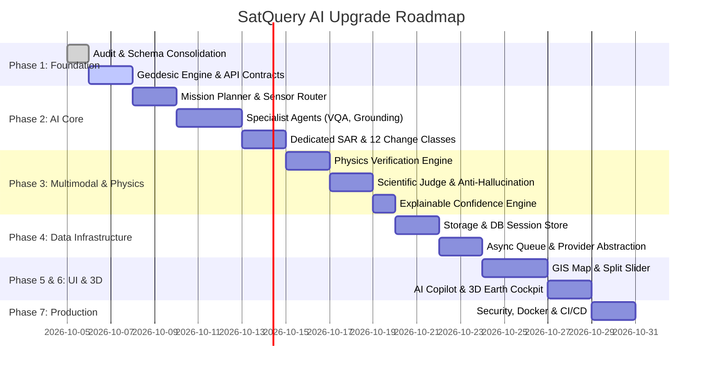

# SatQuery AI — Master Implementation Plan

> **SIH26167 / ISRO Space Applications Centre Problem Statement**  
> Multimodal Agentic Remote Sensing Intelligence Platform  
> **Target Version**: v3.5.0 Production-Ready  
> **Status**: Approved for Execution

---

## 1. Plan Overview & Engineering Philosophy

This master plan details the staged upgrade of the existing SatQuery AI repository into a production-grade, multimodal, agentic Earth observation platform.

### Core Engineering Principles
1. **Preserve Vikram's GeoCV Engine**: Zero regression on the working bi-temporal change detection pipeline, STSF-Net pseudo-change suppression, and Otsu/bimodal confidence engine. All 148 existing tests must remain 100% green.
2. **Zero Fake Capabilities**: If an external LLM, GPU, or live satellite API is unavailable, the system transparently executes deterministic, physics-based fallback algorithms and clearly badges the mode as `OFFLINE / DETERMINISTIC`. Never fabricate confidence or satellite data.
3. **Evidence-Driven Claims**: Every final assertion must be backed by an immutable `EvidenceRecord` linking the finding to raster pixels, sensor metadata, spectral indices, and physical verification checks.
4. **Honest Abstention**: When confidence is insufficient or sensors contradict without physical explanation, the system emits `TARGET_NOT_FOUND` or `UNCERTAIN` rather than hallucinating answers.

---

## 2. Phase-by-Phase Implementation Roadmap

---

## 3. Detailed Work Breakdown Structure (WBS)

### Phase 1: Foundation & Geospatial Core (P0)
- [x] **Task 1.1: Comprehensive Repository Audit**
  - Generated `docs/FEATURE_AUDIT.md`.
  - Documented status of all 32 core capabilities.
- [x] **Task 1.2: System Architecture Specification**
  - Generated `docs/ARCHITECTURE.md`.
- [ ] **Task 1.3: Unified Data Contracts & Schemas**
  - Unify `backend/app/schemas.py` and `satquery/agent/schemas.py`.
  - Implement formal schemas: `EvidenceRecord`, `FindingRecord`, `PhysicsValidationResult`, `ScientificVerdict`, `QueryIntent`, `TaskDAG`.
- [ ] **Task 1.4: Enhanced Geodesic Geospatial Engine**
  - Implement `satquery/core/geospatial.py`:
    - Real-world geodesic area calculations ($m^2$, ha, $km^2$, acres).
    - Robust Affine $\rightarrow$ Native CRS $\rightarrow$ WGS84 (`EPSG:4326`) coordinate transformations.
    - Strict RFC 7946 GeoJSON compliance with per-feature properties (`label`, `confidence`, `area_ha`, `evidence_id`, `timestamp`).
- [ ] **Task 1.5: REST API v1 Standardization**
  - Align endpoints in `satquery/api/v1/` to the target REST specification:
    - `/health`
    - `/api/v1/assets/upload`, `/api/v1/assets/{id}`, `/api/v1/assets/{id}/preview`
    - `/api/v1/sessions`, `/api/v1/sessions/{id}`
    - `/api/v1/queries`, `/api/v1/runs/{id}`, `/api/v1/runs/{id}/trace`
    - `/api/v1/analyze/{vqa, grounding, change, sar, fusion}`
    - `/api/v1/findings/{id}`, `/api/v1/findings/{id}/geojson`
    - `/api/v1/reports`, `/api/v1/reports/{id}/download`

### Phase 2: AI Core Specialist Agents (P0)
- [ ] **Task 2.1: Autonomous Mission Planner**
  - Enhance `satquery/agent/planner.py`:
    - Automatically determine task type (`vqa`, `scene_description`, `grounding`, `temporal_change`, `flood_mapping`, `deforestation`, `urban_expansion`, `sar_analysis`, `multimodal_fusion`).
    - Infer target entity, required modality, temporal ordering, and compute budget.
    - Generate deterministic fallback Task DAG if LLM is unavailable.
- [ ] **Task 2.2: Autonomous Sensor Router**
  - Create `satquery/agent/sensor_router.py`:
    - Inspect raster metadata: band count, wavelengths, polarizations ($VV, VH, HH, HV$), resolution, and tags.
    - Route intelligently (e.g. cloudy flood scene $\rightarrow$ SAR; vegetation health $\rightarrow$ Optical NDVI; urban expansion $\rightarrow$ NDBI + Change Detection).
- [ ] **Task 2.3: VQA & Scene Captioning Agents**
  - Create `satquery/agent/specialists/vqa.py` and `captioning.py`:
    - Implement image-grounded visual question answering.
    - Return structured scene descriptions (land cover, water, vegetation, buildings, roads, terrain, clouds, sensor info).
    - Provide deterministic computer-vision fallback when VLM is absent.
- [ ] **Task 2.4: Open-Vocabulary Grounding Agent**
  - Create `satquery/agent/specialists/grounding.py`:
    - Detect targets (`buildings`, `roads`, `water`, `bridges`, `construction sites`).
    - Return pixel bounding boxes, CRS coordinates, and polygonized GeoJSON.
- [ ] **Task 2.5: Change Detection Engine Extension (12 Classes)**
  - Update `satquery/change_detection/metrics.py`:
    - Implement classification rules for all 12 requested classes:
      `vegetation_loss`, `vegetation_gain`, `water_expansion`, `water_reduction`, `urban_growth`, `urban_loss`, `bare_land_change`, `construction`, `deforestation`, `flooding`, `possible_damage`, `unknown_change`.
    - Preserve STSF-Net pseudo-change suppression and Otsu thresholding without modification.
- [ ] **Task 2.6: Dedicated SAR Specialist Agent**
  - Create `satquery/agent/specialists/sar.py`:
    - Implement radiometric calibration to $\sigma^0$ (dB).
    - Support $VV$, $VH$, $VV/VH$ ratio, Lee speckle filtering, threshold-based flood inundation, and SAR temporal differencing.
- [ ] **Task 2.7: Cryptographic Evidence Agent**
  - Create `satquery/agent/evidence.py`:
    - Construct tamper-evident `EvidenceRecord` for every claim.
    - Attach source image hash, spectral values, bounding geometry, and tool trace.

### Phase 3: Multimodal Intelligence, Physics & Anti-Hallucination (P0)
- [ ] **Task 3.1: Optical + SAR Cross-Modal Fusion**
  - Upgrade `satquery/agent/fusion.py`:
    - Align optical reflectance with microwave backscatter.
    - Complementary fusion: optical penetrates land cover, SAR penetrates cloud cover.
- [ ] **Task 3.2: Physics Verification Engine**
  - Create `satquery/physics/verifier.py`:
    - Deterministic verification tests:
      - Water check: $\text{NDWI} > 0.15$ or $\Delta \text{SAR}_{\text{dB}} < -3.0$
      - Vegetation check: $\text{NDVI} > 0.35$ (gain) or $\Delta \text{NDVI} < -0.20$ (loss)
      - Built-up check: $\text{NDBI} > 0.10$
      - Spatial consistency & Minimum viable area
- [ ] **Task 3.3: Scientific Judge**
  - Create `satquery/agent/judge.py`:
    - Arbitrate multi-agent and multi-sensor findings.
    - Output verdicts: `confirmed`, `probable`, `uncertain`, `rejected`, `target_not_found`.
- [ ] **Task 3.4: Anti-Hallucination System**
  - Create `satquery/agent/anti_hallucination.py`:
    - Enforce confidence thresholds:
      - $\ge 0.80 \rightarrow \text{HIGH}$
      - $0.60 - 0.79 \rightarrow \text{MEDIUM}$
      - $0.40 - 0.59 \rightarrow \text{LOW}$
      - $< 0.40 \rightarrow \text{VERY LOW}$ (Trigger `TARGET_NOT_FOUND`)
    - Prohibit claiming ungrounded objects.
- [ ] **Task 3.5: Explainable Composite Confidence Engine**
  - Create `satquery/agent/confidence_engine.py`:
    - Combine: model score, physics agreement, spatial consistency, temporal consistency, sensor agreement, and bimodal histogram separation.
    - Provide transparent, user-readable explanation of why the confidence score was assigned.

### Phase 4: Data Infrastructure & Storage (P1)
- [ ] **Task 4.1: Storage Abstraction Layer**
  - Implement `satquery/storage/`:
    - Unified interface for `LocalStorage`, `S3Storage`, and `MinIOStorage`.
    - Organized folder structure: `originals/`, `previews/`, `masks/`, `overlays/`, `geojson/`, `reports/`.
- [ ] **Task 4.2: Persistent Database & Session Store**
  - Implement `satquery/db/`:
    - SQLAlchemy models for `Session`, `ImageAsset`, `Query`, `AnalysisRun`, `Finding`, `Evidence`, `Report`.
    - Spatial indexing support with SQLite/PostGIS readiness.
- [ ] **Task 4.3: Async Processing & Background Worker**
  - Implement `satquery/queue/`:
    - Non-blocking execution returning `202 Accepted`.
    - Real-time Server-Sent Events (SSE) and polling endpoints (`GET /api/v1/runs/{id}/trace`).
- [ ] **Task 4.4: Satellite Data Provider Abstraction**
  - Implement `satquery/providers/`:
    - Abstract `SatelliteProvider` interface with `SentinelProvider`, `ISROProvider`, `NASAGIBSProvider`, and `LocalDatasetProvider`.
- [ ] **Task 4.5: Model Provider Abstraction**
  - Implement `satquery/models/`:
    - Pluggable `ModelProvider` supporting Gemini, OpenAI-compatible APIs, Ollama, HuggingFace, and Local Offline Mock.

### Phase 5: Frontend Enhancement & Copilot UI (P1)
- [ ] **Task 5.1: Interactive GIS Map Viewer**
  - Embed interactive mapping in `frontend/`:
    - Leaflet/OpenStreetMap basemap integration.
    - GeoJSON vector overlay with color-coded change polygons and bounding boxes.
    - Click-to-inspect feature popup displaying label, area (ha), confidence, and evidence.
- [ ] **Task 5.2: Before/After Synchronized Split Slider**
  - Upgrade bi-temporal viewer:
    - Side-by-side and draggable vertical split slider.
    - Synchronous zoom and pan controls.
- [ ] **Task 5.3: Conversational Copilot Interface**
  - Upgrade chat panel:
    - Multi-turn conversational memory.
    - Direct action buttons: "Show on Map", "Why This Result?", "Generate Report".
- [ ] **Task 5.4: Live Agent Execution Trace**
  - Display step-by-step progress cards with status badges, latencies, observations, and explicit reasoning.

### Phase 6: 3D Visualization Cockpit (P2)
- [ ] **Task 6.1: Three.js Earth Cockpit**
  - Upgrade globe visualization:
    - Interactive 3D Earth with day/night illumination and satellite orbital path.
    - 2D Map $\leftrightarrow$ 3D Globe seamless toggle.
    - Transparent disclaimer badge: *"3D terrain is illustrative; elevation data source: SRTM/None"*.

### Phase 7: Production Readiness, Security & Reports (P1)
- [ ] **Task 7.1: Security & Input Hardening**
  - Implement `satquery/security/`:
    - Path traversal sanitizer, MIME type validator, file size caps, and prompt injection defense.
- [ ] **Task 7.2: Comprehensive Intelligence Report Generator**
  - Implement `satquery/reports/`:
    - Multi-format generation: JSON, GeoJSON (RFC 7946), Markdown, and PDF.
    - Professional layout with investigation ID, query, sensor metadata, change metrics, evidence summary, and physics verification trace.
- [ ] **Task 7.3: Docker & Orchestration**
  - Create production-ready `Dockerfile` and `docker-compose.yml` (services: `frontend`, `api`, `worker`, `postgres`, `redis`).
- [ ] **Task 7.4: CI/CD & Automated Testing**
  - Add GitHub Actions workflow `.github/workflows/ci.yml` covering linting, type checks, and pytest suites.
- [ ] **Task 7.5: Full Documentation Suite**
  - Write `docs/API.md`, `docs/FEATURES.md`, `docs/DEPLOYMENT.md`, `docs/SECURITY.md`, `docs/DATA_MODEL.md`, `docs/AGENTS.md`, `docs/DEMO.md`.

---

## 4. Testing & Verification Strategy

| Test Suite | Purpose | Target |
| :--- | :--- | :---: |
| **Unit Tests** | Verify spectral math, Otsu, STSF filter, SAR dB, Geodesic areas | > 50 tests |
| **Agent Protocols** | Verify Planner, Sensor Router, Specialists, Fusion, Judge | > 30 tests |
| **Physics Verification** | Verify honest rejection of contradictory AI claims | > 20 tests |
| **Adversarial & Security** | Test path traversal, inverted timestamps, CRS mismatch, corrupted TIFFs | > 25 tests |
| **End-to-End Integration** | Complete flow: Upload $\rightarrow$ Query $\rightarrow$ Task DAG $\rightarrow$ Evidence $\rightarrow$ GeoJSON $\rightarrow$ Report | 100% Pass |
| **Regression Safeguard** | Existing 148 tests in `tests/` and `backend/tests/` | **148/148 Pass** |
